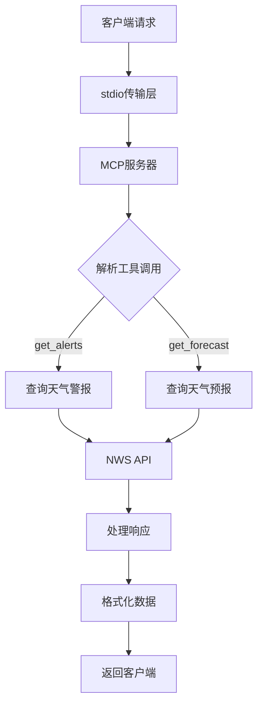

[reference](https://modelcontextprotocol.io/quickstart/server#claude-for-desktop-integration-issues)

[show](https://claude.ai/share/2eb48931-2fd3-4522-9174-f92603225029)

```json
{
  "mcpServers": {
    "weather": {
      "command": "node",
      "args": ["D:\\fanruan\\MCP\\weather\\build\\index.js"]
    }
  }
}
```


# 通信流程
